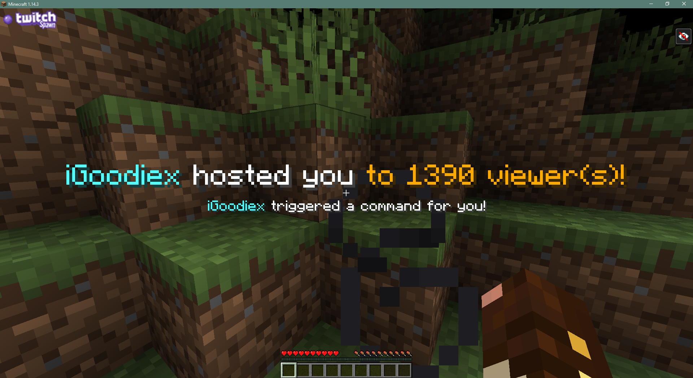
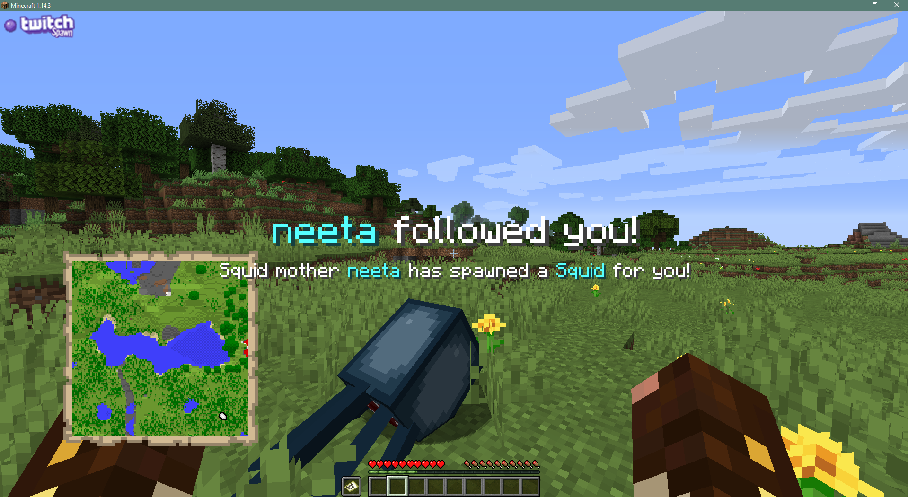
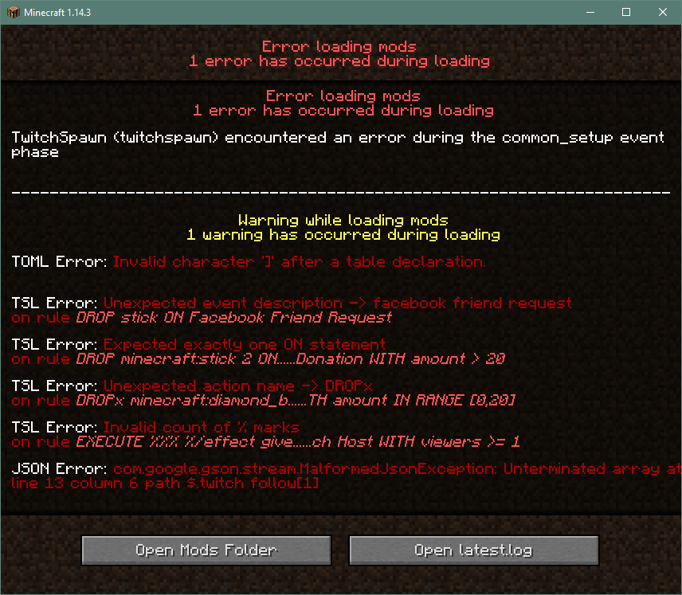

<p align="center"></p>

<!-- Badges -->
<p align="center">
  <a href="https://www.twitch.tv/"></a>
  <a href="https://streamlabs.com"></a>
  <a href="https://streamelements.com"></a>
  <br/>
  <a href="https://minecraft.curseforge.com/projects/twitchspawn"></a>
  <a href="https://minecraft.curseforge.com/projects/twitchspawn"></a>
  <br/>
  <a href="https://twitter.com/iGoodiex"></a>
  <a href="https://www.patreon.com/iGoodie"></a>
</p>

Long waited update is finally here! :tada: 1.14 Adaptation is alive! (See the [user manual](https://igoodie.gitbook.io/twitchspawn/)!)

## Brief Summary
TwitchSpawn is a Minecraft mod designed for Twitch streamers using 3rd party streaming platforms!

It listens for live events related to your Twitch channel using various Socket APIs.
Then it handles those events with the rules handcrafted by you!

You can say hi to us by giving our Discord Server a visit! (https://discord.gg/KNxxdvN)




## How to use?
Complete user manual can be found on https://igoodie.gitbook.io/twitchspawn/

## Features
### 1. All the events!
Thanks to the power of **SocketIO**, the mod is now able to respond to a wide variety of events!
*Donations, follows, subscriptions, resubs, bits* and many more events including for Youtube and Mixer as well!
List of supported streaming platforms:
- Streamlabs - (https://dev.streamlabs.com/docs/socket-api)
- StreamElements - (https://developers.streamelements.com/websockets)

(See 📜 TSL Events & Predicates - https://igoodie.gitbook.io/twitchspawn/twitchspawn-language/tsl-events-and-predicates)

### 2. Your own, readable rules!
The mod now comes with its own language to understand you: **TwitchSpawn Language (TSL)**!
With TSL, declaring event handling rules (rule sets) is piece of cake! It is easily understandable.
(E.g following sequence is a valid TSL script: `DROP minecraft:diamond ON Twitch Follow`)

(See 📜 TSL Basics - https://igoodie.gitbook.io/twitchspawn/twitchspawn-language/tsl-basics)

```coffeescript
# Drops 2 sticks on 0 to 20 unit donation
DROP minecraft:stick 2
 ON Donation
 WITH amount IN RANGE [0,20]

EITHER # Selects one random action
 # Either drops a diamond block
 DROP diamond_block 1
 OR
 # Or drops an iron block named "Iron Golem Body"
 DROP %iron_block{display:{Name:"\"Iron Golem Body\""}}% 2
 OR
 # Or summons a zombie on given coordinate
 SUMMON minecraft:zombie ~ ~+10 ~
 # By displaying one common message for any action selected!
 ALL DISPLAYING %["Get ready for spoils of battle!"]%
 ON Donation
 WITH amount IN RANGE [21, 999]

# Executes a Minecraft command as the streamer being the source!
EXECUTE %/gamerule keepInventory true%
 DISPLAYING %[
  {text:"${actor}", color:"red"},
  {text:" turned immortality on!", color:"white"},
 ]%
 ON Donation
 WITH amount >= 1000

 # Instantly does two actions! Throws leggings and boots from the inventory!
BOTH INSTANTLY
 THROW leggings AND THROW boots
 DISPLAYING %["You forgot to wear your pants!"]%
 ON Twitch Subscription
 WITH months >= 2

# Drops a stick with NBT data, when a Twitch Follow is received!
DROP %minecraft:stick{display:{Name:"\"Stick of Truth!\""}}% 1
 ON Twitch Follow
```

### 3. One server, multiple streamers!
The mod is capable of parsing more than one ruleset,
which makes it possible for multiple streamers to use TwitchSpawn on the same server!

(See 📄 credentials.toml - https://igoodie.gitbook.io/twitchspawn/reference/configurations/credentials.toml)

Exemplar credentials.toml:
```toml
moderatorsTwitch = [ "Redowar" ]
moderatorsMinecraft = [ "Redowar" ]

[[streamers]]
	minecraftNick = "iGoodie"
	twitchNick = "iGoodiex"
	platform = "Streamlabs"
	token = "YOUR_SOCKET_TOKEN_HERE"

[[streamers]]
	minecraftNick = "iGoodie"
	twitchNick = "iGoodiex"
	platform = "StreamElements"
	token = "YOUR_SOCKET_TOKEN_HERE"
```

### 4. Way better customizability
You can customize the text that is shown on an action,
with an easy JSON format and well known Minecraft Text Component syntax!

(See 💿 Minecraft JSON Text Components - https://github.com/skylinerw/guides/blob/master/java/text%20component.md)

(See 📘 Customizing Messages - https://igoodie.gitbook.io/twitchspawn/basics/customizing-messages)

Exemplar messages.title.json:
```json
{
  "donation": [
    {
      "text": "${actor}",
      "color": "aqua"
    },
    {
      "text": " donated you ${amount_f}${currency}",
      "color": "white"
    }
  ],
  "twitch follow" : [ ... ],
  "twitch subscription" : [ ... ],
  ...
}
```
### 5. More reliable than before!
Unlike the previous (1.12.x) versions, errors will not cause Minecraft to crash with no report.
Instead it is aimed to show errors to the user as much as possible.
If you're facing any sort of problem, do not hasitate giving our Discord Server a visit!

(👾 Discord Invite: https://discordapp.com/invite/KNxxdvN)



## Translations
* My Guildies: Elanor & Vaelios - German and French translations :tada:
* [SE7-KN8](https://github.com/SE7-KN8) - German translation of `test` command module keys

If you would like to contribute to the translations, consider modifying
[languages](https://github.com/iGoodie/TwitchSpawn/tree/master/src/main/resources/assets/twitchspawn/lang)
and creating a PR!

## Special Thanks
Special thanks to each one of those beautiful people:
* [Redowar](https://www.twitch.tv/redowar) - For igniting the initial idea of dropping (*actually Spawn'ing :p*) stuff in-game, dev-version testing and his amazing company!
* [ToastNomNomNom](https://www.twitch.tv/toastnomnomnom) - For reaching me, motivating me for a whole new paradigm and helping me do the alpha testings!
* [Köfteistköfte](https://www.youtube.com/user/kofteistkofte) - For his amazing OS_RUN action idea and testings!
* [AdmiralLemon](https://www.twitch.tv/theadmirallemon) - For his bug reports and helps on debugging!
* [Darkphan](https://www.twitch.tv/darkphan) - For his precious Github issues and suggestions!
* [iskall85](https://www.twitch.tv/iskall85) - For reaching me and motivating me for a 1.12.x refactor/port!
* [TheGreatGildersneeze](https://www.twitch.tv/thegreatgildersneeze) - For his amazing TwitchSpawn server and correction on a misleading documentation page!
* [JimilT92](https://github.com/JimiIT92) - For his amazing insight on placeholder expressions and detailed issues!
* [BisUmTo](https://www.twitch.tv/bisumto) - For his priceless bug-reports and endless effort on debugging them!
* [Diaval](https://github.com/thediaval) - For his epic memes and pair programming sessions!
* [Azelza](https://www.twitch.tv/azelzagaming) - For his unconditional support and love to the Spawn Project!
* [Atanend](https://www.twitch.tv/atanend), [DesimieS](https://www.twitch.tv/desimies), [Katayanka](https://www.twitch.tv/kata1925), [Grishnack](https://www.twitch.tv/grishnackx) and [Taul](https://www.twitch.tv/taulnyb) - For their assist in alpha testing the TSL2.0 early features!
* My Guildies: Elanor & Vaelios - For preparing German and French translations!
* And every single person in our [Discord Server](https://discord.gg/KNxxdvN) for keeping us motivated on this project!

## Facing an Issue?
- Join our Discord Server - https://discordapp.com/invite/KNxxdvN
- Contact iGoodie via Discord: iGoodie#1945
- Create an issue on Github: https://github.com/iGoodie/TwitchSpawn/issues
