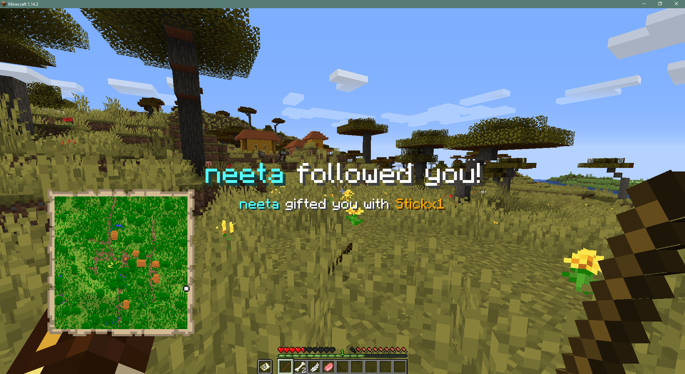

<!-- Badges -->

  
  
   
  
  

## Brief Summary
TwitchSpawn is a Minecraft mod designed for Twitch streamers using Streamlabs!

It listens for live events related to your Twitch channel using Streamlabs Socket API.
Then it handles those events with the rules handcrafted by you!

## How to use?
Complete user manual can be found on https://igoodie.gitbook.io/twitchspawn/

## Facing an Issue?
- Contact iGoodie via Discord: iGoodie#1945
- Create an issue on Github: https://github.com/iGoodie/TwitchSpawn/issues
