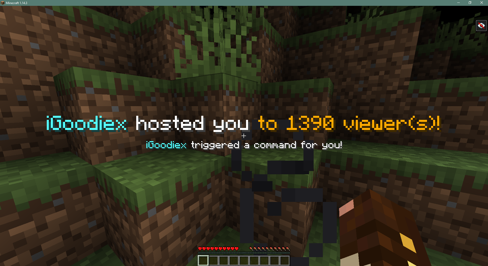

<p align="center"></p>

<!-- Badges -->
<p align="center">
  <a href="https://www.twitch.tv/"></a>
  <a href="https://streamlabs.com"></a>
  <br/>
  <a href="https://minecraft.curseforge.com/projects/twitchspawn"></a>
  <a href="https://minecraft.curseforge.com/projects/twitchspawn"></a>
</p>

Long waited update is finally here! :tada: 1.14 Adaptation is alive!

## Brief Summary
TwitchSpawn is a Minecraft mod designed for Twitch streamers using Streamlabs!

It listens for live events related to your Twitch channel using Streamlabs Socket API.
Then it handles those events with the rules handcrafted by you!




## How to use?
Complete user manual can be found on https://igoodie.gitbook.io/twitchspawn/

## Features
### 1. All the events!
Thanks to Streamlabs Socket API, the mod is now able to respond to a wide variety of events!
Donations, follows, subscriptions, resubs, bits and many more events including for Youtube and Mixer as well!
### 2. Your own, readable rules!
The mod now comes with its own language to understand you: TwitchSpawn Language (TSL)!
With TSL, declaring event handling rules (rule sets) is piece of cake!
It is easily understandable. (E.g following sequence is a valid TSL script: DROP minecraft:diamond ON Twitch Follow).
Exemplar TSL ruleset:
```coffeescript
# Donation Rules
DROP minecraft:stick 2
 ON Streamlabs Donation
 WITH amount IN RANGE [0,20]
 
EITHER # My very important comment
 DROP diamond_block 1
 OR
 DROP %iron_block{display:{Name:"\"Iron Golem Body\""}}% 2
 OR
 SUMMON minecraft:zombie ~ ~+10 ~
 ALL DISPLAYING %["Get ready for spoils of battle!"]%
 ON Streamlabs Donation
 WITH amount IN RANGE [21, 999]

EXECUTE %/gamerule keepInventory true%
 DISPLAYING %[
  {text:"${actor}", color:"red"},
  {text:" turned immortality on!", color:"white"},
 ]%
 ON Streamlabs Donation
 WITH amount >= 1000
 
 # Subscription Rules
BOTH INSTANTLY
 THROW leggings AND THROW boots
 DISPLAYING %["You forgot to wear your pants!"]%
 ON Twitch Subscription
 WITH months >= 2

# Follow Rules
DROP %minecraft:stick{display:{Name:"\"Stick of Truth!\""}}% 1
 ON Twitch Follow
```
### 3. One server, multiple streamers!
The mod is capable of parsing more than one ruleset,
which makes it possible for multiple streamers to use TwitchSpawn on the same server!
Exemplar credentials.toml:
```toml
moderatorsTwitch = [ "Redowar" ]
moderatorsMinecraft = [ "Redowar" ]

[[streamers]]
	socketToken = "SOCKET_TOKEN_HERE"
	minecraftNick = "iGoodie"
	twitchNick = "iGoodiex"
	accessToken = "ACCESS_TOKEN HERE"

[[streamers]]
	socketToken = "SOCKET_TOKEN_HERE"
	minecraftNick = "Toastnomnomnom"
	twitchNick = "ToastNomNomNom"
	accessToken = "ACCESS_TOKEN HERE"
```
### 4. Way better customizability
You can customize the text that is shown on an action,
with an easy JSON format and well known Minecraft Text Component syntax!
Exemplar messages.title.json:
```json
{
  "streamlabs donation": [
    {
      "text": "${actor}",
      "color": "aqua"
    },
    {
      "text": " donated you ${amount_f}${currency}",
      "color": "white"
    }
  ],
  "twitch follow" : [ ... ],
  "twitch subscription" : [ ... ],
  ...
}
```
### 5. More reliable than before!
Unlike the previous (1.12.x) versions, errors will not cause Minecraft to crash with no report.
Instead it is aimed to show errors to the user as much as possible.


## Facing an Issue?
- Contact iGoodie via Discord: iGoodie#1945
- Create an issue on Github: https://github.com/iGoodie/TwitchSpawn/issues
